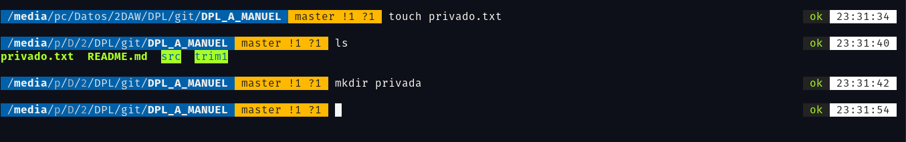
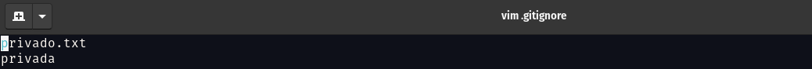
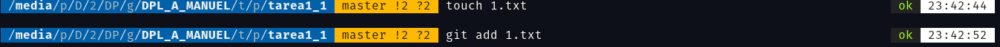
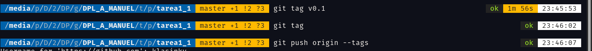
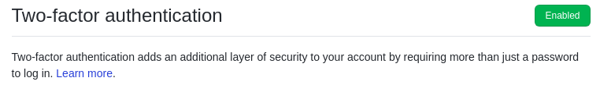
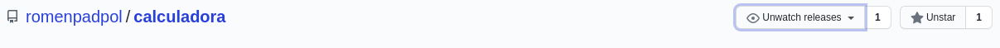

# Tarea 1_1

## Comandos utilizados hasta ahora:

#### Clonar el repositorio: 

`git clone https://github.com/klasinky/DPL_A_MANUEL.git`

#### Agregar los cambios hechos: 

`git add -A`

#### Hacer el commit: 

`git commit -m 'Primer commit'`

#### Subir al repositorio remoto: 

`git push origin master`

## Ignorar Archivos

#### Crear en el repositorio local un fichero llamado privado.txt.
#### Crear en el repositorio local una carpeta llamada privada

#### Realizar los cambios oportunos para que tanto el archivo como la carpeta sean ignorados por git. 

## AÑADIR FICHERO 1.txt
#### Añadir 1.txt al repositorio local

## CREAR EL TAG v0.1

#### Crear tag y subirlo al repositorio remoto

## CONFIGURACIÓN Y USO SOCIAL DE  GITHUB

#### Poner una foto en vuestro perfil de GitHub :heavy_check_mark:

#### Poner el doble factor de autentificación en vuestra cuenta de GitHub

#### Seguir los repositorios  de vuestros compañeros y Añadir una estrella a los repositorios  del resto de tus compañeros

| Nombre | Github                                     |
|--------|--------------------------------------------|
| Jorge  | [Enlace](https://github.com/Jorgeev27)     |
| Hector | [Enlace](https://github.com/Earthlander28) |
| Cristo | [Enlace](https://github.com/CristoJGM2612) |
| Guido  | [Enlace](https://github.com/guidocalippo)  |

