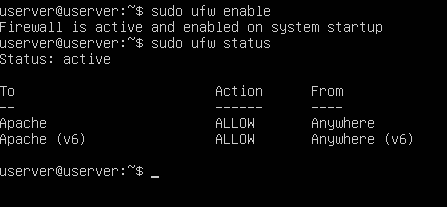
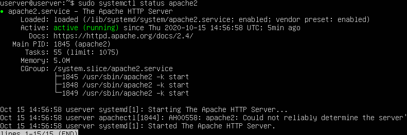
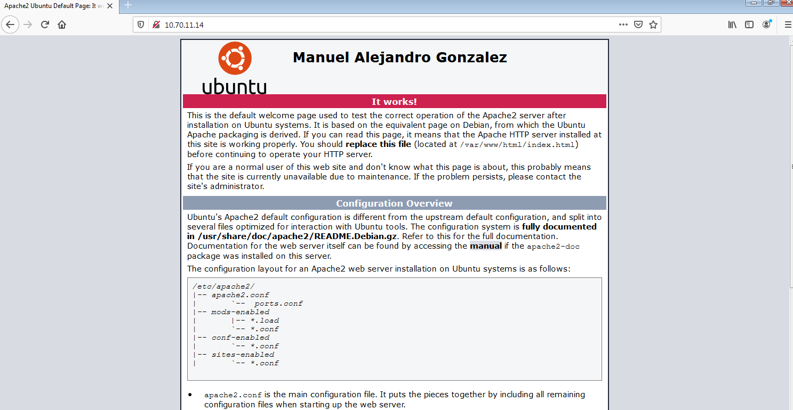

# Práctica 2.2- Instalación del servidor web Apache en Ubuntu Server

### 1. Instalar Apache.

Para instalar el apache usamos el siguiente comando: `sudo apt install apache2`

Comprobamos que esté instalada

### 2. Configurar el firewall.

Se recomienda habilitar el perfil más restrictivo, que de todos modos permitirá el tráfico que configuró. Debido a que en esta práctica aún no configuramos SSL para nuestro servidor, solo deberemos permitir el tráfico en el puerto 80:

Verificamos el cambio con el siguiente comando

Como la regla no está activa, tenemos que activar el firewall

### 3. Comprobar el estado del servidor web.

Al final del proceso de instalación, Ubuntu 20.04 inicia Apache. El servidor web ya debería estar activo. Lo comprobamos con el siguiente comando:

También lo comprobamos mediante un navegador:

