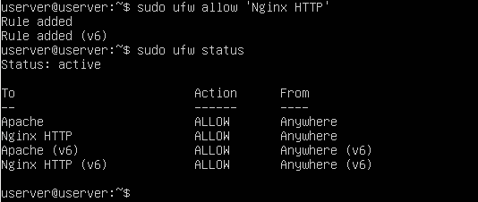
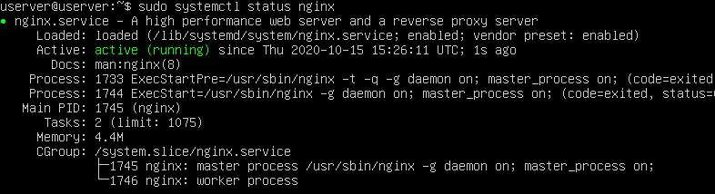
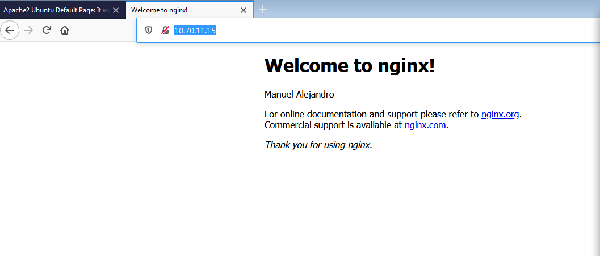

# Práctica 2.3- Instalación del servidor web NGINX en Ubuntu Server

### 1. Instalar Nginx.

Para instalar nginx tenemos que usar el siguiente comando `sudo apt install nginx`

Comprobamos esté instalado

### 2. Configurar el firewall.

Se recomienda habilitar el perfil más restrictivo, que de todos modos permitirá el tráfico que configuró. En este momento, solo tendremos que permitir el tráfico en el puerto 80.

### 3. Comprobar el estado del servidor web.

Comprobamos el funcionamiento del nginx de dos maneras

Mediante el comando `systemctl status nginx`

Con un navegador ingresando la ip del servidor:

