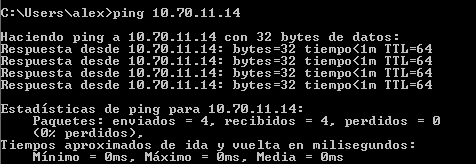

# Práctica 2.1- Red TCP-IP

### 1. Configuración del adaptador de red en VirtualBox.

    Instalando las maquinas virtuales:

    Configuración de red de las maquinas virtuales:

### 2. Configuración del adaptador de red en Windows 7.

### 3. Configuración del adaptador de red en Ubuntu Server.

    Iniciamos la máquina virtual

Vamos al directorio /etc/netplans y editamos el fichero **00-installer-config.yaml** 

Por último, reiniciamos la configuración

### 4. Comprobación de la configuración y de funcionamiento.

Ping desde Windows

