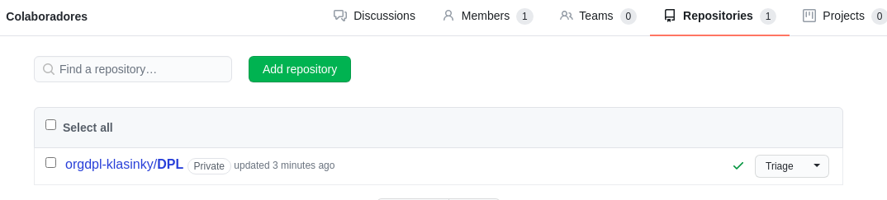

## CREAR UNA RAMA

## AÑADIR  EL FICHERO 2.txt

## CREAR UNA RAMA REMOTA v0.2 

## MERGE DIRECTO

## MERGE CON CONFLICTO

#### Commit en el master del 2.txt

#### Commit en el v0.2 del 2.txt

## LISTADO DE RAMAS

## ARREGLAR  CONFLICTO

Lo que hice fue revisar el archivo y arreglar las lineas que hacían conflicto, luego puse un `git add 2.txt`.

## BORRAR RAMA Y CREAR TAG

## LISTADO DE CAMBIOS

`git log`

## CREAR UNA ORGANIZACIÓN

## CREAR EQUIPOS

#### Permisos de ADMINISTRADORES

#### Permisos de COLABORADORES

